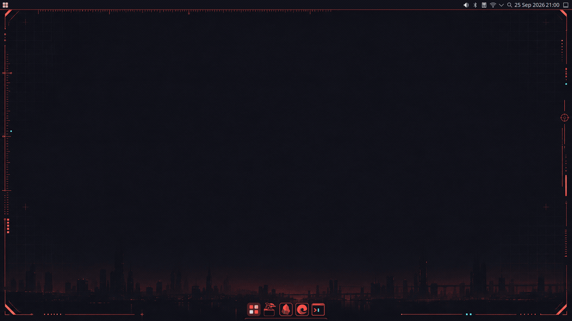
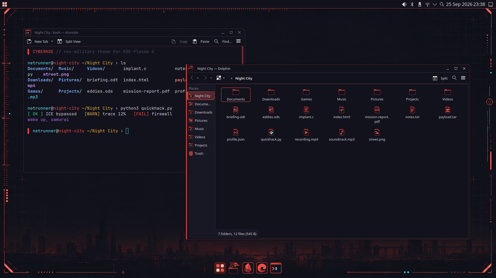
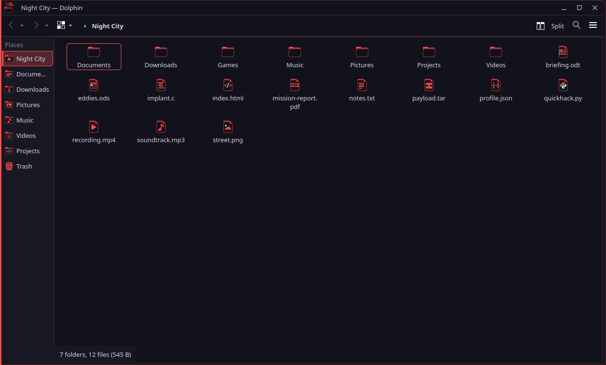
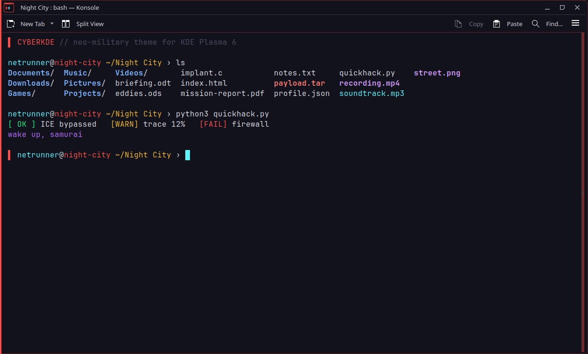
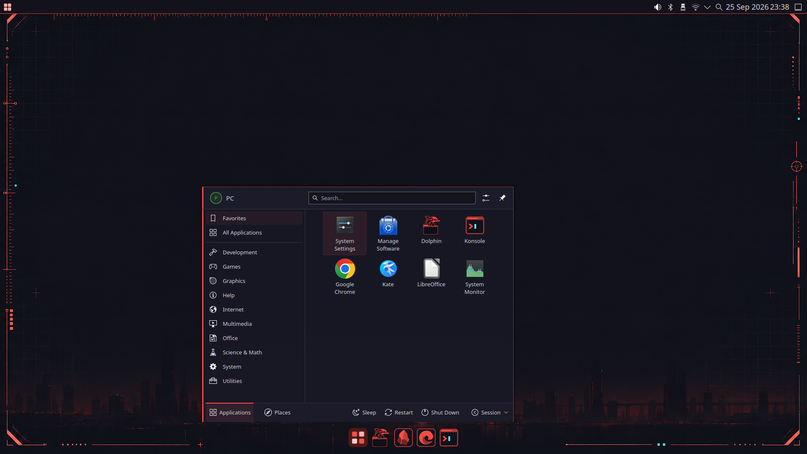
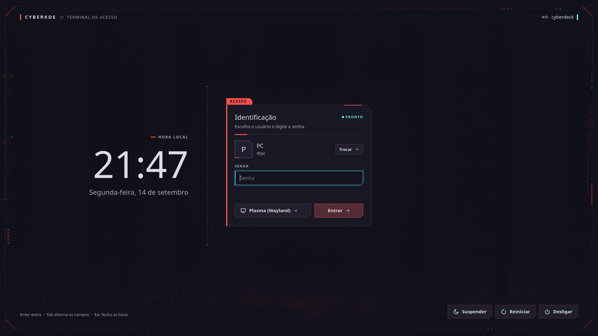

# CyberKDE

Um tema cyberpunk para o KDE Plasma 6, inspirado nos menus de Cyberpunk 2077. Fiz para usar no meu computador e resolvi compartilhar.

Ele muda as cores, as janelas, os ícones, o terminal e a tela de login, e coloca algumas animações. Liga com `cyberkde on`; o `cyberkde off` deixa tudo como estava antes.

*[Read in English](README.md)*





| | |
|---|---|
|  |  |
|  |  |

As capturas mostram o resultado de uma instalação nova com `./instalar.sh --ligar`: a barra em cima e uma dock do [Latte Dock NG](https://github.com/jrcn1991/latte-dock-ng), que o instalador oferece instalar no Ubuntu 26.04.

> Projeto de fã, sem ligação com a CD PROJEKT. Nada aqui vem do jogo: todas as imagens foram feitas para este tema.

## O que ele muda

| Parte | O que muda |
|---|---|
| Cores + Kvantum | esquema de cores e estilo Kvantum chanfrado para todos os apps Qt/KDE |
| Arranjo | barra em cima e dock embaixo, como nas capturas (instalações novas; `cyberkde layout`) |
| Janelas | moldura Aurorae e animação de "varredura" ao abrir e fechar janelas (KWin) |
| Plasma | estilo do Plasma (painel, menus, popups, notificações) e efeito de animação dos popups |
| Ícones | pastas, locais, tipos de arquivo e um golfinho ciborgue como ícone do Dolphin; o resto herda o Breeze Escuro |
| Konsole | esquema de cores e perfil |
| Login | tela de login do SDDM, splash e fundo da tela de bloqueio |
| Papel de parede | área de trabalho e tela de bloqueio |
| Cor de destaque | regenera o tema inteiro em qualquer cor |
| Opcional | Dolphin com cascata ao abrir pastas e Konsole com texto e cursor animados, os dois compilados com um pequeno patch |

## Instalar (versão completa, recomendada)

Requisitos: KDE Plasma 6, `python3`, ImageMagick, `qdbus6`, os ícones Breeze e o Kvantum para Qt 6.

```bash
# Ubuntu / Debian / Kubuntu
sudo apt install git python3 imagemagick qdbus-qt6 kf6-breeze-icon-theme qt-style-kvantum
# outras distribuições: instale os pacotes equivalentes (o instalador lista o que faltar)

git clone https://github.com/jrcn1991/theme-cyberkde.git
cd theme-cyberkde
./instalar.sh --ligar    # instala e já liga (./instalar.sh só instala)
```

Antes de copiar qualquer coisa, o instalador confere os requisitos e os problemas conhecidos abaixo e mostra a correção de cada um. Um item com `✗` impede a instalação. Um item com `!` deve ser corrigido antes (com `--continuar`, segue assim mesmo). A mesma checagem roda a qualquer hora com `cyberkde checar`.

No Ubuntu 26.04, ele também oferece instalar o [Latte Dock NG](https://github.com/jrcn1991/latte-dock-ng), a dock das capturas (`--sem-latte` pula): o pacote gerado a partir de um commit revisado do fork [jrcn1991/latte-dock-ng](https://github.com/jrcn1991/latte-dock-ng) do [Latte Dock NG](https://github.com/ruizhi-lab/latte-dock-ng) (que por sua vez é a versão para o Plasma 6 do [Latte Dock](https://invent.kde.org/plasma/latte-dock) da KDE), conferido por um SHA-256 fixo no tema. O Latte só é oferecido onde foi validado de ponta a ponta (por enquanto, o Ubuntu 26.04); nos outros sistemas, a dock é um painel flutuante do Plasma. Nada é compilado na sua máquina. Se você já usa o Latte, o tema usa o seu.

A instalação é por usuário. O root só é pedido para o pacote do Latte e para a tela de login. O programa fica em `~/.local/opt/cyberkde` e o comando em `~/.local/bin/cyberkde`, então a pasta clonada pode ser apagada depois. Para atualizar, baixe a versão nova e rode `./instalar.sh` de novo.

### Problemas conhecidos

| Problema | Correção |
|---|---|
| `cyberkde: comando não encontrado` logo depois de instalar | O `~/.local/bin` só entra no `PATH` no login, se a pasta já existir. Saia e entre na sessão; até lá, use `~/.local/bin/cyberkde` ou `export PATH="$HOME/.local/bin:$PATH"`. O `./instalar.sh --ligar` não precisa disso. |
| Tela de login preta depois de reiniciar (Ubuntu com SDDM, sem Xorg) | O SDDM precisa rodar em Wayland. O `cyberkde checar` mostra o arquivo de `/etc/sddm.conf.d` a criar. Não é causado pelo tema. |
| Sem animações numa máquina virtual | Com vídeo por software (llvmpipe), o KWin desliga todas as animações. Ligue a aceleração 3D da VM. O `cyberkde status` diz se as animações estão carregadas. |

## Usar

```
cyberkde on              # liga tudo
cyberkde off             # desliga e devolve todos os valores originais
cyberkde status          # o que está ligado (e se as animações carregaram)
cyberkde checar          # requisitos e problemas conhecidos, com a correção de cada um
cyberkde layout tema     # barra em cima + dock, como nas capturas ('manter' deixa seus painéis)
cyberkde latte           # instala o pacote revisado do Latte Dock NG (Ubuntu 26.04)
cyberkde cor '#5EF6FF'   # troca a cor de destaque ('cyberkde cor padrao' volta ao vermelho)
cyberkde papel ~/Imagens/minha.jpg   # papel de parede próprio ('cyberkde papel padrao' volta ao do tema)
cyberkde on <parte>      # só uma parte: dolphin, apps, janelas, icones, icones-sistema, konsole,
                         # plasma, barra-e-dock, papeis-de-parede, login
```

- **Reversível de propósito.** Cada chave de configuração que o tema muda tem o valor original registrado na primeira vez que é gravada, e cada arquivo substituído ganha uma cópia. O `cyberkde off` percorre esse registro de trás para a frente.
- **Seus painéis também voltam.** O arranjo de barra e dock guarda os painéis do Plasma antes de mudar, e o `cyberkde off` os devolve.
- **Root só para a tela de login.** Ela fica em `/usr` e `/etc`, e por isso o `cyberkde` pede a senha do sudo só nessa parte.
- **Um tema por vez.** Desligue outro tema global antes do `cyberkde on` e rode `cyberkde off` antes de aplicar outro. O tema guarda como "original" o que encontra ao ligar.

### Opcional: Dolphin e Konsole animados

Cascata ao abrir pastas (Dolphin) e texto "decodificando" com halo e rastro do cursor (Konsole). São o Dolphin e o Konsole com um patch pequeno, distribuídos como pacotes prontos, gerados no Ubuntu 26.04 a partir da mesma versão que o Ubuntu distribui e conferidos por um SHA-256 fixo no tema. Nada é compilado na sua máquina. Eles ficam ao lado dos apps do sistema (em `/opt`); o tema só aponta o atalho para eles, e o `cyberkde off` devolve.

```
cyberkde animados        # o instalador oferece no Ubuntu 26.04
```

São oferecidos só no Ubuntu 26.04 e só enquanto a versão do Dolphin/Konsole dele for a do pacote; depois que o Ubuntu os atualiza, ficam os apps do sistema até sair pacote novo. Sem eles instalados, o `cyberkde on` só os pula.

### Junto com o AppleKDE

O CyberKDE e o [AppleKDE](https://github.com/jrcn1991/tema_apple_kde) nunca ficam misturados. Se o AppleKDE estiver ligado, o `cyberkde on` roda antes o `applekde off`, confere que ele desligou de verdade e só então aplica; se não der para confirmar (AppleKDE ocupado, etapa que pede root sem terminal), nada é aplicado e ele diz o que rodar. O `applekde on` faz o mesmo no sentido contrário. Sem o AppleKDE instalado, nada muda.

## Desinstalar

```bash
cyberkde uninstall       # ou ./desinstalar.sh
```

Desliga o tema, devolve todos os valores originais e apaga os arquivos do tema, as suas preferências do CyberKDE e o próprio programa.

## Versão da KDE Store

As peças também estão na [KDE Store](https://store.kde.org), no vermelho padrão: Tema Global, estilo do Plasma, moldura de janelas, Kvantum, ícones, SDDM, esquemas de cores, efeitos do KWin e papel de parede. Essa versão se instala por *Configurações do Sistema → Obter novos…*. Ela não tem troca de cor, animações do Dolphin e do Konsole nem liga/desliga com um comando, mas não precisa de nada além do Plasma. O `scripts/empacotar-loja.sh` gera esses pacotes.

## Testado em

Kubuntu 26.04 e Ubuntu 26.04 (com o Plasma instalado), Plasma 6.6, Wayland; também numa VM limpa do Ubuntu com 4 GB de memória. Outras distribuições com Plasma 6 devem funcionar. Relatos são bem-vindos nas issues.

## Licença

- Código, geradores, patches e arquivos gerados do tema: **GPL-3.0-or-later** (ver [LICENSE](LICENSE)).
- Arte (ícones em `assets/icons`, papéis de parede em `assets/wallpapers`): **CC BY-SA 4.0** (ver [LICENSES/CC-BY-SA-4.0.txt](LICENSES/CC-BY-SA-4.0.txt)).
- Fontes Rajdhani e Orbitron: **SIL Open Font License 1.1** (ver `assets/fonts/`).

Detalhes em [CREDITS.md](CREDITS.md).
